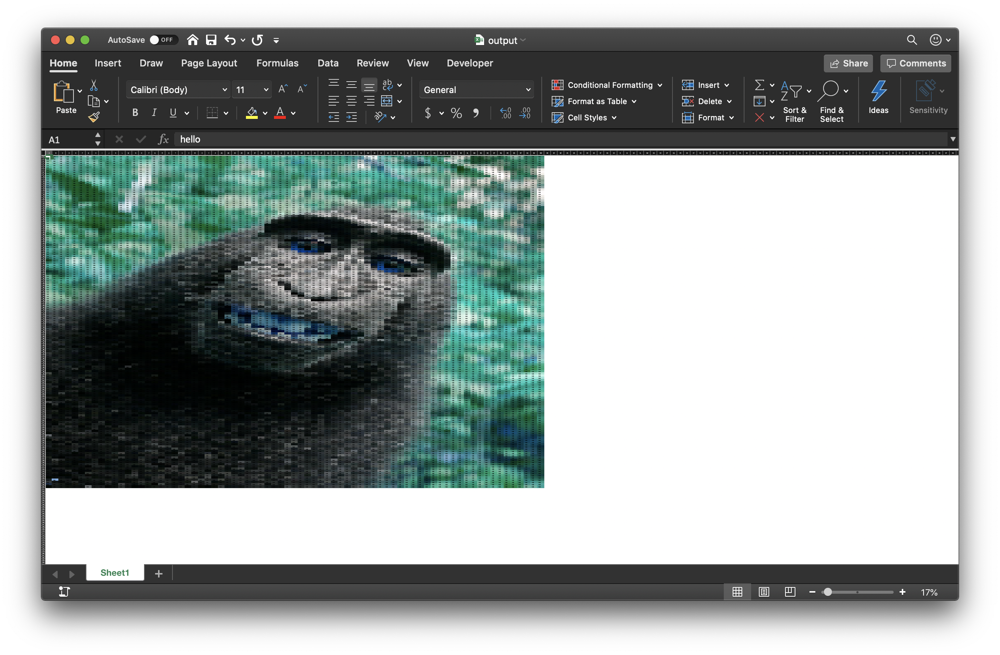

# image2excel
Lightweight Python code to convert your images into a cool looking excel spreadsheet

## Usage
For usage: Visit my blog where I explain how to use this:

GO TO MY BLOG HERE >>> [Creating photo spreadsheet with Python](https://vulcancoder.com/2019/11/02/how-to-create-a-photo-excel-spreadsheet-in-python/)

## Output
